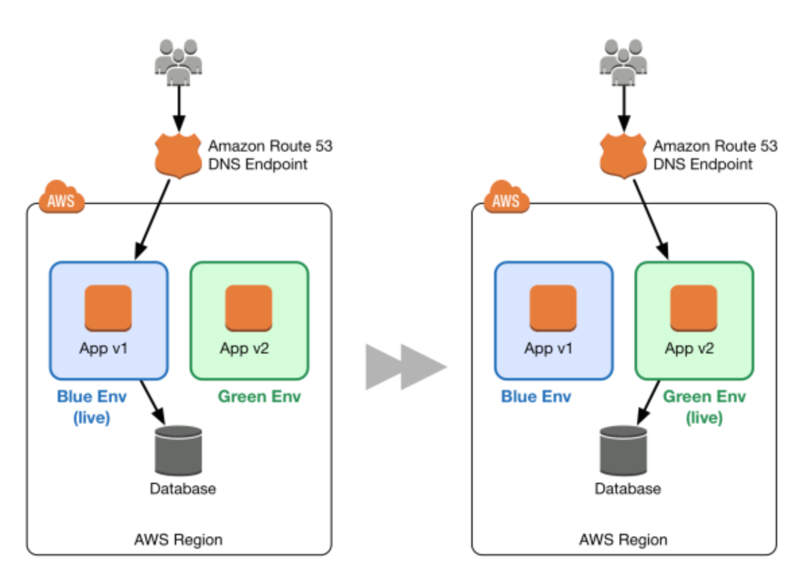

## 介绍

在传统的应用部署方法中，通常通过重新部署较旧的，稳定版本的应用来修复失败的部署。由于配置额外资源的成本和工作量，传统数据中心的重新部署通常在同一组资源上完成。虽然这种方法有效，但它有许多缺点。回滚并不容易，因为它是通过从头开始重新部署旧版本来实现的。此过程需要时间，使应用程序可能长时间不可用。甚至应用只有受损的情况下，覆盖错误版本的回滚才被需要。结果，您没有机会调试错误的应用程序。

践行AWS平台的敏捷性，可伸缩性，公共设施消耗和自动化功能的原则可以改变应用程序部署的范例。这样可以实现更好的部署方法，即蓝/绿部署。

### 蓝绿部署方法论

蓝/绿部署提供接近零停机时间的发布和回滚功能。蓝/绿部署背后的基本思想是在运行不同版本应用的两个相同环境之间转移流量。蓝色环境代表服务于生产流量的当前应用程序版本。与此同时，绿色环境是即将服务的环境，运行另一个版本的应用。绿色环境准备就绪并经过测试后，生产流量将从蓝色重定向到绿色。如果发现任何问题，您可以通过将流量恢复到蓝色环境以实现回滚。

图1: 基本的蓝色/绿色示例

虽然蓝/绿部署不是一个新概念，由于配置其他资源所需的成本和工作量，您通常不会在传统的本地托管环境中看到它。云计算的出现极大地改变了采用蓝/绿方法部署软件的简单性和成本效益。

### 蓝/绿的优点

