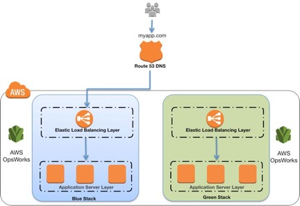
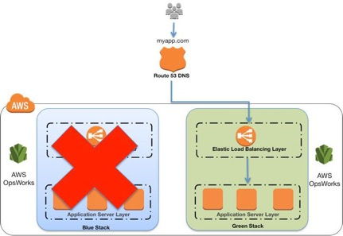

## 介绍

在传统的应用部署方法中，通常通过重新部署较旧的，稳定版本的应用来修复失败的部署。由于配置额外资源的成本和工作量，传统数据中心的重新部署通常在同一组资源上完成。虽然这种方法有效，但它有许多缺点。回滚并不容易，因为它是通过从头开始重新部署旧版本来实现的。此过程需要时间，使应用程序可能长时间不可用。甚至应用只有受损的情况下，覆盖错误版本的回滚才被需要。结果，您没有机会调试错误的应用程序。

践行AWS平台的敏捷性，可伸缩性，公共设施消耗和自动化功能的原则可以改变应用程序部署的范例。这样可以实现更好的部署方法，即蓝/绿部署。

### 蓝绿部署方法论

蓝/绿部署提供接近零停机时间的发布和回滚功能。蓝/绿部署背后的基本思想是在运行不同版本应用的两个相同环境之间转移流量。蓝色环境代表服务于生产流量的当前应用程序版本。与此同时，绿色环境是即将服务的环境，运行另一个版本的应用。绿色环境准备就绪并经过测试后，生产流量将从蓝色重定向到绿色。如果发现任何问题，您可以通过将流量恢复到蓝色环境以实现回滚。

图1: 基本的蓝色/绿色示例

虽然蓝/绿部署不是一个新概念，由于配置其他资源所需的成本和工作量，您通常不会在传统的本地托管环境中看到它。云计算的出现极大地改变了采用蓝/绿方法部署软件的简单性和成本效益。

### 蓝/绿的优点
传统上，通过就地升级，很难在生产部署中验证新的应用版本的同时还能继续运行旧版本的应用。蓝/绿部署在您的蓝和绿应用环境之间提供了一定程度的隔离。它保证创建的平行绿色环境不会影响支撑蓝色环境的资源。这种隔离降低了部署的风险。

在部署完绿色环境之后，你有机会对其进行验证。在将生产流量发送到绿色环境之前，可以通过测试流量或者使用一小部分的生产流量来验证绿色环境，以更好的反映实际用户的流量。这种方法成为金丝雀分析或者金丝雀测试。即使你发现绿色环境没有达到预期，这一切也不会对蓝色环境有什么影响。你可以将流量重新返回蓝色环境，最小化受损操作或停机时间，限制影响的冲击半径。

这种简单地将流量回滚到仍然运行的蓝色环境的能力是蓝/绿部署的主要优势。您可以在部署过程中随时回滚到蓝色环境。由于影响仅限于绿色环境问题检测和流量转移回蓝色环境之间的时间窗口，因此受损操作或停机时间能做到最小化。此外，影响仅限于流向绿色环境的流量，而不是所有流量。如果部署错误的冲击半径降低了，则整体部署风险也会降低。

蓝/绿部署也适用于持续集成和持续部署（CI / CD）工作流，在许多情况下限制了它们的复杂性。您的部署自动化必须考虑对现有环境，状态或配置的较少依赖性。您的新绿色环境将部署到一组全新的资源上。

在AWS中，蓝色/绿色部署还提供成本优化优势。你不需要依赖于相同的底层资源。因此，如果应用程序的性能范围从一个版本更改为另一个版本，则只需启动有优化资源的新环境，无论是更少的资源还是仅仅是不同的计算资源。您也不必长时间运行过度配置的体系结构。在部署过程中，随着更多流量被发送到绿色环境，您可以扩展绿色环境，同时，蓝色环境会收到较少的流量，你可以缩减蓝色环境。一旦部署陈工，你可以退役蓝色环境，不再需要为蓝色环境的资源付费。

### 定义环境边界
在规划蓝/绿部署时，必须考虑环境边界 - 哪里有变更，哪些需要部署以实现这些变更。环境边界受许多因素的影响，如下表所述。
|    因素         | 准则 |
| ----------- | ----------- |
| 应用架构    | 依赖性，松/紧耦合   |
| 组织结构    | 迭代的速度和次数 |
| 风险和复杂性 | 冲击半径和部署失败的影响   |
| 人员       | 团队的专长 |
| 流程       | 测试/QA，回滚能力   |
| 成本      | 运营预算，额外资源 |

表格1: 影响环境边界的因素

例如，运行基于微服务架构模式的应用程序的组织可能具有较小的环境边界，因为各个服务之间存在松散耦合和明确定义的接口。运行传统的巨石应用的组织仍然可以利用蓝/绿部署，但环境范围可能更宽泛，测试更广泛。无论环境边界如何，都应该尽可能利用自动化来简化流程，减少人为错误并控制成本。

## AWS中保障蓝/绿部署的工具与服务
AWS提供了许多工具和服务，可帮助你通过AWS API自动化和简化部署和基础架构，你可以使用Web控制台，CLI工具，SDK和IDE来利用这些API。由于AWS生态系统中提供了许多服务，因此以下内容并非完整列表。相反，此列表仅提供我们在本文中将讨论的服务的概览。你可以在AWS之外找到软件解决方案来帮助自动化和监控基础架构和部署，但本文主要关注AWS服务。

### Amazon Route 53
Amazon Route 53是一种高可用且可扩展的权威DNS服务，可将用户对基于Internet资源的请求路由到适当的目标。Amazon Route 53运行在一个由DNS服务器组成的全球网络上，为客户提供了附加的功能，比如基于健康检查、地理位置和延迟的路由。DNS是蓝/绿部署的经典方法，允许管理员通过简单地更新托管区域中的DNS记录来引导流量。此外，存活时间（TTL）可以调整资源记录; 这对于有效的DNS模式很重要，因为较短的TTL允许更改的记录更快地传播到客户端。

### Elastic Load Balancing
为蓝/绿部署路由流量的另一种常见方法是使用负载均衡技术。Elastic Load Balancing在指定的Amazon Elastic Compute Cloud（Amazon EC2）实例之间分配进入的应用流量。Elastic Load Balancing基于传入的请求进行伸缩，针对Amazon EC2资源执行健康检查，并自然地与其他AWS工具集成，例如Auto Scaling。对于希望提高应用容错性的客户来说，这是一个很好的选择。

### Auto Scaling
Auto Scaling有助于维护应用程序可用性，并允许客户根据定义的条件自动伸缩EC2容量。在Auto Scaling组中用于启动EC2实例的模板被称为*启动配置*。可以将不同版本的启动配置附加到Auto Scaling组以启用蓝/绿部署。还可以配置Auto Scaling以与Elastic Load Balancing负载均衡器配合使用。在此配置中，Elastic Load Balancing会平衡Auto Scaling组中运行的EC2实例的流量。可以在Auto Scaling组中定义终止策略，以确定在伸缩操作期间要删除的EC2实例。如“Auto Scaling开发人员指南”中所述，Auto Scaling还允许将实例置于待机状态，而不是终止，这有助于在需要时快速回滚。Auto Scaling的终止策略和待机状态都支持蓝/绿部署。

### AWS Elastic Beanstalk
AWS Elastic Beanstalk是一种在AWS上启动和运行应用程序的快速而简单的方法。对于希望部署代码而不必担心管理底层基础设施的开发人员来说，它是完美的。Elastic Beanstalk支持Auto Scaling和Elastic Load Balancing，两者都支持蓝/绿部署。Elastic Beanstalk可以轻松运行多个版本的应用，并提供交换环境URL的功能，从而促进蓝/绿部署。

### AWS OpsWorks
AWS OpsWorks是一种基于Chef的配置管理服务，允许用户在AWS上部署和管理应用堆。用户可以指定资源和应用程序配置，以及部署和监视运行资源。在准备蓝/绿环境时，OpsWorks简化了克隆整个堆栈的过程。

### AWS CloudFormation
AWS CloudFormation使客户能够通过JSON格式的模板描述他们所需的AWS资源。此服务提供非常强大的自动化功能，用于配置蓝/绿环境并促进交换流量的更新，无论是通过Route 53 DNS，还是Elastic Load Balancing等。服务可以作为更庞大的基础架构中的一部分作为代码策略使用，该基础架构使用代码和软件开发技术(如版本控制和持续集成)，类似于处理应用代码的方式以分配和管理。

### Amazon CloudWatch
Amazon CloudWatch是AWS云资源和运行在AWS上的应用的监控服务。CloudWatch可以收集和跟踪指标，收集和监控日志文件以及设置警报。它提供了系统范围内对资源利用率，应用程序性能和运行状况的可视性，这对于蓝/绿部署中的应用运行状况的早期检测至关重要。

## 方法

以下方法是如何在AWS上实现蓝/绿的示例。虽然我们强调每种方法中的特定服务，但你可能还有其他服务或工具来实现相同的模式。根据现有架构，应用程序的性质以及组织中软件部署的目标，选择合适的模式。尽可能多地进行尝试，为你的环境获得更多的经验，并了解不同的部署风险因素如何与特定工作负载相互作用。

### 使用Amazon Route 53更新DNS路由
通过记录更新进行DNS路由是蓝/绿部署的常用方法。DNS是将流量从蓝色环境切换到绿色环境的机制，如果需要回滚，则反之亦然。此方法适用于各种环境配置，只要你可以将endpoint作为DNS名称或IP地址表示到环境中。

在AWS中，此方法适用于以下环境：
- 单实例，具有公共或弹性IP地址
- Elastic Load Balancing负载均衡器或第三方负载均衡器下游的实例组
- Auto Scaling组中的实例，以Elastic Load Balancing负载均衡器作为前端
- 在Elastic Load Balancing负载均衡器下游的Amazon EC2容器服务（Amazon ECS）群集上运行的服务
- Elastic Beanstalk环境Web层
- 暴露IP或DNS端点的其他配置

图2 经典DNS模式
图2显示了Amazon Route 53如何管理DNS托管域。通过更新别名记录，可以将流量从蓝色环境路由到绿色环境。

您可以一次性转移所有流量，也可以进行加权分配。使用Amazon Route 53，可以定义进入绿色环境的流量百分比以并逐渐更新权重，直到绿色环境承载完整的生产流量。加权分布通过将一小部分生产流量引入新环境以提供金丝雀分析的能力。可以测试新代码并监控错误，如果遇到任何问题，则限制冲击半径。如果使用了Elastic Load Balancing，还允许绿色环境向外扩展以支持完整的生产负载，比如，Elastic Load Balancing会自动调整其请求处理容量，以满足入站应用程序流量；伸缩过程不是瞬间的，因此我们建议你测试，观察并了解你的流量模式。负载均衡器也可以通过请求支持以预先加热（配置为最佳容量）。

图3 经典的DNS权重分配

如果在部署期间出现问题，可以通过更新DNS记录来实现回滚，以将流量转回到蓝色环境。虽然DNS路由很容易实现蓝/绿，但问题是可以多快完成回滚。DNS TTL确定客户端缓存查询结果的时间。但是，对于更陈旧的和潜在行为不规范的客户端，某些会话仍可能与之前的环境相关联。尽管回滚可能具有挑战性，但这种模式的确有利于按照自己的进度进行颗粒度转换，以便对伸缩活动进行更实质的测试。为帮助管理成本，请考虑使用Auto Scaling为EC2实例根据实际需求扩展资源。这适用于使用Amazon Route 53加权分配的逐步转换。要进行完全转换，请务必调整Auto Scaling策略以按预期进行扩展，并记住新的Elastic Load Balancing endpoint可能也需要时间进行扩展。

### 在弹性负载均衡器下游交换Auto Scaling组
如果DNS复杂性过高，请考虑将负载均衡用于蓝/绿环境的流量管理。此方法使用Auto Scaling管理蓝/绿环境的EC2资源，根据实际需求进行扩展或缩小。你还可以通过更新特定组的最大所需实例的数量来控制Auto Scaling组大小。

Auto Scaling还与Elastic Load Balancing集成，因此如果任何新实例通过负载均衡器管理的健康检查，则会自动添加到负载均衡池。Elastic Load Balancing使用简单的ping或更复杂的连接尝试或请求来测试已注册的EC2实例的运行状况。健康检查以可配置的时间间隔进行，并具有定义的阈值来确定实例是健康的还是不健康。例如，可以使用Elastic Load Balancing运行状况检查策略，每隔20秒ping一次80端口，并在通过10次成功ping的阈值后，将实例报告为InService。如果足够多的ping请求超时，则报告该实例为OutofService。与Auto Scaling配合使用，如果Auto Scaling策略发出指示，则可以替换OutofService实例。相反，对于收缩活动，负载均衡器会从池中删除EC2实例，并在终止之前消耗完当前连接。

图4 交换Auto Scaling组模式

图4显示了环境边界缩小到了Auto Scaling组。蓝色组承载生产负载，同时使用新代码部署的绿色组处于准备状态。在部署时，只需将绿色组附加到现有负载均衡器上，将流量引入新环境。对于HTTP / HTTPS侦听器，负载均衡器倾向于绿色Auto Scaling组，因为它使用最少未完成的请求路由
算法，如Elastic Load Balancing开发人员指南中所述。你可以通过调整整绿色组的容量来控制引入的流量。

图5 蓝色Auto Scaling组节点处于待机和停用状态

在扩展绿色Auto Scaling组时，可以通过终止蓝色Auto Scaling组实例或将其置于待机状态使蓝色Auto Scaling组实例停止服务，如在Auto Scaling开发人员指南中讨论的那样。待机是一个不错的选择，因为如果需要回滚到蓝色环境，只需将蓝色服务器实例重新投入使用即可。只要绿色组的增加没有任何问题，可以通过将组大小调整为零来退役蓝色组。

此模式的流量管理功能不像经典DNS那样精细，但仍然可以通过Auto Scaling组的配置来控制。例如，可以使用更精细的扩展策略来拥有更多的小型实例，这也有助于控制扩展成本。由于没有了DNS的复杂性，因此流量转移本身更为便利。此外，使用已经很预热的负载平衡器，你可以确信将具备支持生产负载的容量。

### 更新Auto Scaling组启动配置

Auto Scaling组具有自己的启动配置。启动配置包含Amazon Machine Image（AMI）ID，实例类型，密钥对，一个或多个安全组以及块设备映射等信息。一次只能将一个启动配置与一个自动伸缩组关联，并且在创建后无法对其进行修改。要更改与Auto Scaling组关联的启动配置，请将现有启动配置替换为新配置。在启用新的启动配置后，启用的任何新实例都将使用新的启动配置参数，但现有实例不受影响。当Auto Scaling从组中删除实例（收缩）时，默认的终止策略是删除具有最早启动配置的实例。但是，你应该记住，如果可用性区域一开始就不平衡，那么Auto Scaling可能会删除具有新启动配置的实例以平衡区域。在这种情况下，您应该有适当的流程来弥补这种影响。

要实现此方案，首先要使用Auto Scaling组和Elastic Load Balancing负载均衡器。当前的启动配置使用蓝色环境。

要在绿色环境中部署新版本的应用，请使用新的启动配置更新Auto Scaling组，然后将Auto Scaling组扩展到其原始大小的两倍。
图6 更新启动配置模式

扩展绿色启动配置

然后，将Auto Scaling组缩小回原始大小。默认情况下，首先删除具有旧启动配置的实例。还可以利用组的待机状态临时从Auto Scaling组中删除实例，如Auto Scaling开发人员指南中所述。如果需要，使实例处于待机状态有助于快速回滚。只要对新部署的应用程序版本有信心，就可以永久删除处于待机状态的实例。

图8 收缩蓝色启动配置
要执行回滚，使用旧的启动配置更新Auto Scaling组。然后，反过来执行上述步骤。或者，如果实例处于待机状态，将它们置回服务。

### 交换Elastic Beanstalk应用环境

Elastic Beanstalk可以快速轻松地部署和管理应用程序，而无需担心运行这些应用程序的基础架构。要使用Elastic Beanstalk部署应用程序，请以应用程序包的形式上传应用程序版本（例如，java .war文件或.zip文件），然后提供有关应用程序的一些信息。根据应用程序信息，Elastic Beanstalk在蓝色环境中部署应用程序，并提供访问环境的URL（通常用于Web服务器环境）。

Elastic Beanstalk提供了几种可配置使用的部署策略，范围从对现有实例执行就地更新的策略，到使用一组新实例的不可变部署。由于Elastic Beanstalk在更新应用版本时执行就地更新，因此应用可能会在短时间内无法供用户使用。

但是，可以通过将新版本部署到单独的环境中来避免不可用。复制现有环境的配置，并使用新版本的应用启动绿色环境。新绿色环境将拥有自己的URL，当要上线绿色环境以服务生产流量时，可以使用Elastic Beanstalk的交换环境URL功能，如AWS Elastic Beanstalk开发人员指南中所述。

要实现此技术，可以使用Elastic Beanstalk来启动蓝色环境。

图9 Elastic Beanstalk环境

在应用程序启动并运行时，Elastic Beanstalk提供一个环境URL。然后，绿色环境将使用自己的环境URL进行启动。此时，两个环境已启动并运行，但只有蓝色环境正在为生产流量提供服务。

图10 准备绿色Elastic Beanstalk环境

要启用绿色环境以服务生产流量，请转到Elastic Beanstalk控制台中的环境仪表板，然后从“操作”菜单中选择“交换环境URL”。Elastic Beanstalk执行DNS切换，通常需要几分钟。有关执行DNS切换时要考虑的因素，请参阅使用Amazon Route 53更新DNS路由的技术。当DNS更改生效时，可以终止蓝色环境。要执行回滚，则再次触发Swap Environment URL（交换环境URL）。

图11 退役蓝色Elastic Beanstalk环境

### 在AWS OpsWorks中克隆堆栈并更新DNS
AWS OpsWorks具有堆栈概念，这些堆栈是AWS资源（EC2实例，Amazon RDS，Elastic Load Balancing等）的逻辑分组，它们具有共同的目的并且应该在逻辑上一起管理。堆栈由一个或多个层组成。层表示一组用于特定目的的EC2实例，例如服务应用程序或托管数据库服务器。当数据存储是堆栈的一部分时，你应该意识到数据管理挑战。我们将在下一节深入讨论这些内容。

要在AWS OpsWorks中实现此方案，请使用当前版本的应用提供蓝色环境/堆栈。

图12 AWS OpsWorks堆栈

接下来，使用较新版本的应用创建绿色环境/堆栈。此时，绿色环境没有接收任何流量。如果Elastic Load Balancing需要预热，可以在此时执行此操作。

图13 克隆堆栈以创建绿色环境

要启用绿色环境到生产环境时，更新DNS记录以指向绿色环境/堆栈的负载均衡器。你还可以使用Amazon Route 53加权路由策略逐步执行此DNS翻转。此方案涉及更新DNS，因此请注意在*使用Amazon Route 53更新DNS路由*的方法中讨论的DNS问题。

图14 退役蓝色堆栈

## 数据同步管理和schema更改的最佳实践

跨两个不同环境管理数据同步可能很复杂，具体取决于所使用的数据存储的数量，数据模型的复杂性以及数据一致性要求。

蓝色和绿色环境都需要最新数据：
- 绿色环境需要最新的数据访问，因为它正在成为新的生产环境
- 在回滚的情况下，蓝色环境需要最新的数据，此时生产要么被回滚，要么保持在蓝色环境中。

从广义上讲，可以通过让绿色和蓝色环境共享相同的数据存储来实现此目的。非结构化数据存储，通常更容易在两个环境之间共享，比如Amazon Simple Storage Service（Amazon S3）对象存储，NoSQL数据库和共享文件系统。结构化数据存储，例如关系数据库管理系统（RDBMS），其中数据schema可能在不同的环境中出现差异，通常需要额外的考虑因素。

### 解耦schema更改与代码更改

一般建议是将schema更改与代码更改分离。这样，关系数据库位于为蓝/绿部署定义的环境边界之外，并在蓝色和绿色环境之间共享。执行schema更改的两种方法经常同时使用。
- 在蓝/绿代码部署之前，先修改schema。数据库更新必须向后兼容，因此旧版本的应用仍然可以与数据进行交互
- 在蓝/绿代码部署之后，最后修改schema。新版本应用中的代码更改必须向后兼容旧版本schema

前一种schema修改方案通常是附加法。在表中添加新字段，添加新实体和关系。如果需要，可以使用触发器或异步流程，基于旧应用版本所执行的数据更改，用数据填充这些新构造。
在开发应用程序时，需要遵循编码最佳实践，以确保应用可以容忍当前表中存在其它字段，即使它们未被使用。当读取表行值并将其映射到源代码结构（对象，数组哈希等）时，代码应忽略无法映射的字段，而不是导致应用程序运行时错误。

前一种schema修改方案通常是删除法。删除不需要的字段，实体和关系，或合并和联合它们。到目前为止，旧版本应用已不再可用。

以这种方式管理schema更改会增加风险：schema修改过程中的失败会影响生产环境。由于没有遵循最佳实践或新应用程序版本仍然依赖于代码中某个已删除字段的无文档化问题，添加的更改可能会导致旧应用程序崩溃。为了适当降低风险，此模式非常强调预部署软件生命周期步骤。确保拥有强大的测试阶段和框架以及强大的QA阶段。在推出生产之前，在测试环境中执行部署有助于尽早识别这些问题。

## 何时不推荐蓝/绿部署

随着蓝/绿部署越来越流行，开发人员和公司不断地将这种方法应用到新的和创新的用例中。然而，有一些常见的用例模式不推荐应用这种方法(即使可能)。

在这些情况下，实施蓝/绿部署会带来太多风险，无论是由于解决方法还是部署过程中的其他“移动部件”。这些复杂性可能会引入额外的故障点，或流程崩溃的机会，这可能会抵消蓝/绿部署带来的任何风险缓解好处。

以下高亮模式可能不适合蓝/绿部署。

#### schema是否变得太复杂而无法与代码更改分离？数据存储的共享是否不可行？

在某些情况下，共享数据存储并不被期望或者可行。schema更改非常复杂以至于无法解耦。当蓝色和绿色环境位于地理上不同区域时，数据位置会给应用程序带来太多的性能下降。当数据存储位于部署环境边界内，并分别与蓝色和绿色应用程序紧密耦合时，所有这些情况都需要解决方案，

这需要数据修改能够同步-从蓝色环境到绿色环境，反之亦然。实现此目的的系统和流程通常很复杂，并且受到应用数据一致性要求的限制。这意味着在部署期间，还必须管理同步工作负载的可靠性，可伸缩性和性能，从而增加部署风险。

### 应用需要具有“部署感知”吗？
在蓝/绿部署期间，必须使用特征标志来控制应用程序的行为。这通常是与无法有效地分离schema和代码更改而相结合的原因。应用代码将在部署期间执行其他或备用子程序，以保持数据同步或执行其他与部署相关的任务。在部署期间，通过使用标志配置，可以启用和关闭这些子程序（视情况而定）。

此做法还会带来额外的风险和复杂性，通常不建议使用蓝/绿部署。蓝/绿部署的目标是实现不可变的基础架构，在部署后不会对应用进行更改，而是完全重新部署。这样，可以确保在生产设置和部署设置中运行相同的代码，从而降低整体风险因素。

### 你的商用现货(COTS)应用程序是否带有一个预定义的更新/升级过程，该过程对蓝/绿部署并不友好？

许多商业软件供应商为他们已经过测试和验证的应用程序提供了自己的更新和升级过程。虽然供应商越来越多地采用不可变基础架构和自动部署的原则，但并非所有软件产品都具备这些功能。

围绕供应商推荐的更新和部署实践来实现或模拟蓝/绿部署过程也可能带来不必要的风险，可能会抵消这种方法的好处。

## 总结

应用部署具有关联风险。但云计算，部署和自动化框架以及蓝/绿等新部署技术的出现有助于降低风险，例如人为错误，流程，停机时间和回滚功能。AWS实用的帐单模型和广泛的自动化工具使客户能够更易于快速，经济高效地实施大规模的蓝/绿部署。

## 贡献者
以下个人和组织为本文件做出了贡献：
- George John，AWS解决方案架构师
- Andy Mui, AWS解决方案架构师
- Vlad Vlasceanu，AWS解决方案架构师

## 附录
### 蓝/绿部署方案对比
下表提供了本文中讨论的不同蓝/绿部署技术的概述和比较。潜在风险从理想的低风险（）到不太理想的高风险（  ）进行评估。

<table>
    <thead>
        <tr>
            <th rowspan="3">方案</th>
            <th>风险类别</th>
            <th>潜在风险</th>
            <th>说明</th>
        </tr>
    </thead>
    <tbody>
        <tr>
            <td rowspan="6">使用Amazon Route 53更新DNS路由</td>
            <td>应用问题</td>
            <td></td>
            <td>促进金丝雀分析</td>
        </tr>
        <tr>
            <td>应用性能</td>
            <td></td>
            <td>逐步切换，流量分流管理</td>
        </tr>
        <tr>
            <td>人为/流程错误</td>
            <td> </td>
            <td>依赖于自动化框架，整体流程简单</td>
        </tr>
        <tr>
            <td>基础设施故障</td>
            <td> </td>
            <td>依赖于自动化框架</td>
        </tr>
        <tr>
            <td>回滚</td>
            <td>  </td>
            <td>DNS TTL复杂性（反应时间，flip/flop）</td>
        </tr>
        <tr>
            <td>成本</td>
            <td></td>
            <td>通过Auto Scaling优化</td>
        </tr>
        <tr>
            <td rowspan="6">在弹性负载均衡器下游交换Auto Scaling组</td>
            <td>应用问题</td>
            <td></td>
            <td>促进金丝雀分析</td>
        </tr>
        <tr>
            <td>应用性能</td>
            <td> </td>
            <td>较低细粒度流量分割管理，已预热的负载均衡器</td>
        </tr>
        <tr>
            <td>人为/流程错误</td>
            <td> </td>
            <td>依赖于自动化框架</td>
        </tr>
        <tr>
            <td>基础设施故障</td>
            <td></td>
            <td>Auto Scaling</td>
        </tr>
        <tr>
            <td>回滚</td>
            <td></td>
            <td>没有DNS的复杂性</td>
        </tr>
        <tr>
            <td>成本</td>
            <td></td>
            <td>通过Auto Scaling优化</td>
        </tr>
        <tr>
            <td rowspan="6">更新Auto Scaling组启动配置</td>
            <td>应用问题</td>
            <td>  </td>
            <td>在不均匀设备中的错误/问题检查比较复杂</td>
        </tr>
        <tr>
            <td>应用性能</td>
            <td>  </td>
            <td>较低细粒度流量分割管理，初始流量负载</td>
        </tr>
        <tr>
            <td>人为/流程错误</td>
            <td> </td>
            <td>依赖于自动化框架</td>
        </tr>
        <tr>
            <td>基础设施故障</td>
            <td></td>
            <td>Auto Scaling</td>
        </tr>
        <tr>
            <td>回滚</td>
            <td></td>
            <td>没有DNS的复杂性</td>
        </tr>
        <tr>
            <td>成本</td>
            <td> </td>
            <td>通过Auto Scaling进行优化，但初始扩展超出需求</td>
        </tr>
        <tr>
            <td rowspan="6">交换Elastic Beanstalk应用环境</td>
            <td>应用问题</td>
            <td>  </td>
            <td>能够在切换之前进行金丝雀分析，但不能用于生产流量</td>
        </tr>
        <tr>
            <td>应用性能</td>
            <td>  </td>
            <td>完整切换</td>
        </tr>
        <tr>
            <td>人为/流程错误</td>
            <td></td>
            <td>流程简单，自动化</td>
        </tr>
        <tr>
            <td>基础设施故障</td>
            <td></td>
            <td>Auto Scaling, CloudWatch monitoring, Elastic Beanstalk健康报告</td>
        </tr>
        <tr>
            <td>回滚</td>
            <td>  </td>
            <td>DNS TTL复杂性</td>
        </tr>
        <tr>
            <td>成本</td>
            <td> </td>
            <td>通过Auto Scaling进行优化，但初始扩展超出需求</td>
        </tr>
        <tr>
            <td rowspan="6">在AWS OpsWorks中克隆堆栈并更新DNS</td>
            <td>应用问题</td>
            <td></td>
            <td>促进金丝雀分析</td>
        </tr>
        <tr>
            <td>应用性能</td>
            <td></td>
            <td>逐步切换，流量分流管理</td>
        </tr>
        <tr>
            <td>人为/流程错误</td>
            <td></td>
            <td>高度自动化</td>
        </tr>
        <tr>
            <td>基础设施故障</td>
            <td></td>
            <td>Auto-healing（自愈）能力</td>
        </tr>
        <tr>
            <td>回滚</td>
            <td>  </td>
            <td>DNS TTL复杂性</td>
        </tr>
        <tr>
            <td>成本</td>
            <td>  </td>
            <td>双重资源栈</td>
        </tr>
    </tbody>
</table>
